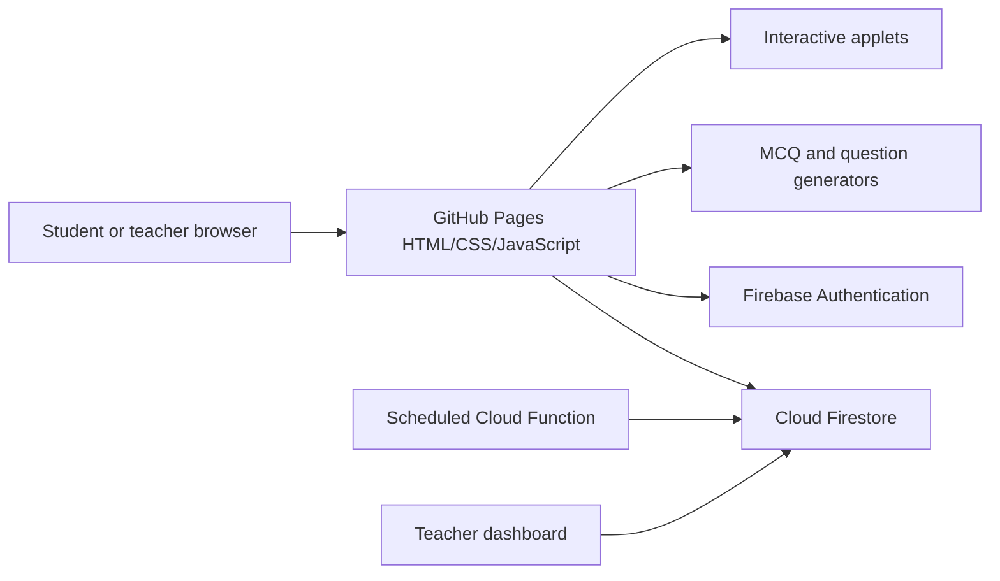

# Architecture

## Overview

DP_Apps combines a static GitHub Pages frontend with optional Firebase services.



## Frontend

- Static HTML pages
- CSS contained in pages and/or shared styles
- Browser JavaScript
- MathJax for mathematical notation
- Inline SVG and browser-rendered diagrams
- GitHub Pages hosting

Most question generation is client-side, which keeps the static learning tools inexpensive to host and easy to distribute.

## Storage abstraction

Recent development work uses a shared provider such as:

```text
js/storage/firebase_provider.js
```

This layer should centralise:

- authentication state;
- joining classes;
- saving progress;
- recording MCQ attempts;
- reading summaries;
- demo-mode behaviour;
- consistent error handling.

Pages should avoid duplicating raw Firestore logic where a provider method already exists.

## Backend

Firebase supplies:

- teacher email/password authentication;
- anonymous demo authentication;
- Firestore persistence;
- security rules;
- a scheduled Cloud Function for demo cleanup.

## Security boundary

The browser is untrusted. Interface controls such as “hidden in demo mode” improve usability but do not provide authorization. Every protected operation must also be rejected or allowed correctly by Firestore rules or trusted server code.

## Deployment boundary

There are two independent deployments:

1. **GitHub Pages / repository files** — HTML, CSS, JavaScript, and applets.
2. **Firebase** — rules, Authentication settings, Firestore data, functions, scheduler.

A frontend commit can be live while its required rules are not, producing “Missing or insufficient permissions.” Likewise, new rules can be live while old GitHub Pages JavaScript still calls outdated paths.
