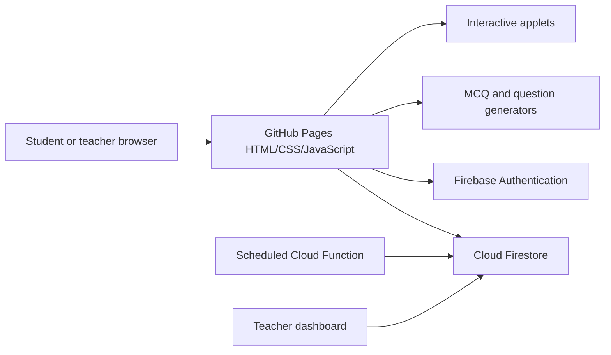

# DP_Apps GitHub Wiki — Combined Preview

---

<!-- Home.md -->

# IB Mathematics Interactive Learning Platform

**DP_Apps** is a browser-based collection of interactive IB Mathematics learning resources, practice tools, question generators, and teacher analytics.

The public site currently centres on **IB Mathematics: Applications and Interpretation (AI)** and presents the course as an **IB AI Archipelago**: a visual syllabus map linking students to interactive applets. The development version also includes newer AA-facing pages and a shared public demo workflow.

> **Documentation status — 12 July 2026**  
> This wiki distinguishes between the public GitHub Pages version and newer local changes that still require deployment verification.

## Start here

- **Students:** [[Student Guide]]
- **Teachers:** [[Teacher Guide]]
- **Try the product:** [[Public Demo]]
- **Set up a local or hosted copy:** [[Getting Started]]
- **Understand the system:** [[Architecture]]
- **Deploy Firebase and GitHub Pages:** [[Deployment]]
- **Resolve common errors:** [[Troubleshooting]]

## Main product areas

| Area | Purpose |
|---|---|
| Syllabus map | Browse 36 interactive AI applets by level and topic |
| MCQ practice | Generate syllabus-aligned questions and save student performance |
| Question Bank Builder | Build printable Paper 1, Paper 2, and HL Paper 3-style material |
| Teacher dashboard | View class progress, syllabus performance, activity, and weak areas |
| Public demo | Let visitors explore a shared class through one-click anonymous sign-in |
| Firebase layer | Store accounts, classes, progress, attempts, and summary statistics |

## Live and development status

| Capability | Public repository/site | Newer development version |
|---|---:|---:|
| 36-app interactive syllabus map | Available | Available |
| MCQ practice by syllabus point | Available | Expanded |
| Teacher login and class tracking | Available | Expanded |
| Question Bank Builder | Available | Major audit-led expansion |
| Anonymous “Try the Live Demo” flow | Not verified live | Implemented locally |
| Shared `PUBLIC-DEMO` activity | Not verified live | Implemented locally |
| Nightly recursive demo reset | Not verified live | Implemented locally; requires Firebase deployment and billing-enabled scheduled functions |
| AA-specific entry/practice pages | Not visible in the older public snapshot | Present in recent local edits |

## Important notice

The generated questions, markschemes, syllabus labels, and teaching resources are independently produced educational material. They are **not official International Baccalaureate content** and should be reviewed by a teacher before use in high-stakes assessment.

## Project links

- [Live site](https://cliff-lee.github.io/DP_Apps/)
- [GitHub repository](https://github.com/Cliff-Lee/DP_Apps)
- [[Release Notes]]
- [[Roadmap]]

---

<!-- Getting-Started.md -->

# Getting Started

DP_Apps is primarily a static HTML, CSS, and JavaScript project. Most applets can run directly in the browser, while class tracking, teacher accounts, saved MCQ results, and the public demo require Firebase.

## Fastest way to explore

1. Open the [live GitHub Pages site](https://cliff-lee.github.io/DP_Apps/).
2. Browse the syllabus map or open **MCQ Practice**.
3. Use the Question Bank Builder to generate a printable test and markscheme.
4. Teacher-only features require a configured Firebase project and teacher account.

## Run locally

A local web server is recommended because browser security restrictions can interfere with modules, authentication, and cross-file navigation when pages are opened with `file://`.

```bash
python3 -m http.server 8000
```

Then open:

```text
http://localhost:8000/
```

Alternative Node-based server:

```bash
npx serve .
```

## Core entry pages

| File | Role |
|---|---|
| `index.html` | Main AI syllabus map and student progress entry point |
| `mcq_practice.html` | AI MCQ practice by syllabus point |
| `dp_ai_questionbank.html` | Printable test and markscheme generator |
| `teacher.html` | Teacher authentication, class management, and analytics |
| `aa_index.html` | Newer AA-facing entry page in the development version |
| `aa_mcq_practice.html` | Newer AA practice page in the development version |

The exact development structure may contain additional shared JavaScript modules, including `js/storage/firebase_provider.js`.

## Static-only use

Without Firebase, the repository still supports:

- opening applets;
- filtering the syllabus map;
- local browser progress where implemented;
- generating questions and markschemes;
- printing or saving generated papers as PDF.

## Firebase-enabled use

Firebase adds:

- email/password teacher sign-in;
- anonymous demo sign-in;
- class creation and loading;
- student nicknames and class membership;
- saved applet progress;
- MCQ attempts and syllabus statistics;
- class reports and weak-area analysis;
- scheduled deletion of public demo data.

Continue with [[Firebase Setup]] and [[Deployment]].

---

<!-- Features.md -->

# Features

## Interactive syllabus map

The public AI landing page presents **36 interactive applets** across the five IB AI topic areas. Students can filter by SL/AHL and topic, join a class, and track completion.

## Interactive applets

The applets are designed to combine several of the following:

- visual exploration;
- guided prompts;
- mathematical notation;
- worked examples;
- dynamic diagrams;
- calculator-oriented steps;
- exam-style practice;
- immediate feedback.

See [[Applet Catalogue]].

## MCQ practice

The MCQ system allows students to select any combination of syllabus points and choose:

- AI SL or AI HL;
- question count;
- mixed, standard, challenge, or hard difficulty;
- visible syllabus points;
- weak-area targeting.

The expanded question styles include calculation, application, diagram interpretation, reverse engineering, parameter changes, multi-step reasoning, critique, misconception diagnosis, and challenge questions.

See [[MCQ Practice]].

## Question Bank Builder

Teachers can create browser-generated papers using selected syllabus points and a reproducible random seed. The interface supports:

- Paper 1-style short response;
- Paper 2-style extended response;
- HL Paper 3-style problem solving;
- diagrams when useful;
- configurable writing space;
- generated markschemes;
- printable output;
- JSON inspection for development and extension.

See [[Question Bank]].

## Teacher dashboard

The teacher dashboard supports:

- teacher sign-in;
- class creation and loading;
- class lists;
- student progress tables;
- applet completion summaries;
- MCQ performance summaries;
- class weak areas;
- student and syllabus filtering;
- CSV export in the newer dashboard work.

See [[Teacher Guide]].

## Public demo

The newer development version includes a one-click anonymous demo connected to a shared `PUBLIC-DEMO` class. Visitors can see and contribute public activity without receiving teacher-level controls.

See [[Public Demo]].

---

<!-- Applet-Catalogue.md -->

# Applet Catalogue

The public repository contains 36 syllabus-linked AI applet files. File names are shown so maintainers can map wiki entries to repository pages.

## Topic 1 — Number and algebra

| Coverage | File |
|---|---|
| SL 1.1 Scientific notation | `sl_1_1_scientific_notation_resource.html` |
| SL 1.2 Arithmetic sequences and series | `sl-1-02-arithmetic-sequences-series.html` |
| SL 1.3 / AHL 1.11 Geometric sequences and series | `sl-1-03-ahl-1-11-geometric-sequences-series.html` |
| SL 1.4–1.7 Financial mathematics | `sl-1-04-sl-1-07-financial-mathematics.html` |
| SL 1.5 / AHL 1.10 Exponents and logarithms | `sl-1-05-ahl-1-10-exponents-logarithms.html` |
| SL 1.6 Accuracy, approximation, and error | `sl-1-06-accuracy-approximation-error.html` |
| AHL 1.12–1.13 Complex numbers | `ahl-1-12-ahl-1-13-complex-numbers.html` |
| AHL 1.14 Matrices | `ahl-1-14-matrices.html` |
| AHL 1.15 Eigenvalues and eigenvectors | `ahl-1-15-eigenvalues-eigenvectors.html` |
| AHL 1.15 Matrix diagonalisation | `ahl-1-15-matrix-diagonalisation.html` |

## Topic 2 — Functions

| Coverage | File |
|---|---|
| SL 2.1 Straight lines | `sl_2_1_straight_lines_resource.html` |
| SL 2.2 Functions | `sl_2_2_functions_resource.html` |
| SL 2.3 Graphs of functions | `sl_2_3_graphs_of_functions_resource.html` |
| SL 2.4 Key features of graphs | `sl_2_4_key_features_graphs_resource.html` |

## Topic 3 — Geometry and trigonometry

| Coverage | File |
|---|---|
| SL 3.1 Three-dimensional geometry | `sl_3_1_3d_geometry_resource.html` |
| SL 3.2 Triangle trigonometry | `sl-3-02-triangle-trigonometry.html` |
| SL 3.4 / AHL 3.7 Arcs, sectors, and radians | `sl_3_4_ahl_3_7_arcs_sectors_radians_resource.html` |
| SL 3.6 Voronoi diagrams | `sl-3-06-voronoi-diagrams.html` |
| AHL 3.9 Affine transformations | `ahl-3-09-affine-transformations.html` |
| AHL 3.10–3.13 Vectors | `ahl-3-10-ahl-3-13-vectors.html` |
| AHL 3.14 Graph theory basics | `ahl-3-14-graph-theory-basics.html` |
| AHL 3.15 Adjacency matrices and walks | `ahl-3-15-adjacency-matrices-walks.html` |
| AHL 3.16 Graph structure and algorithms | `ahl-3-16-graph-structure-algorithms.html` |
| AHL 3.16 Route optimisation | `ahl-3-16-route-optimisation.html` |

## Topic 4 — Statistics and probability

| Coverage | File |
|---|---|
| SL 4.1 Data, sampling, and outliers | `sl_4_1_data_sampling_outliers_resource.html` |
| SL 4.2–4.3 Data presentation and statistics | `sl_4_2_4_3_data_presentation_statistics_resource.html` |
| SL 4.5 Probability | `sl_4_5_probability_resource.html` |
| SL 4.6 Probability representations | `sl_4_6_probability_representations_applet.html` |
| SL 4.11 / AHL 4.18 Hypothesis testing | `sl-4-11-ahl-4-18-hypothesis-testing.html` |
| AHL 4.16 Confidence intervals | `ahl-4-16-confidence-intervals.html` |
| AHL 4.17 Poisson distribution | `ahl_4_17_poisson_distribution_resource.html` |
| AHL 4.19 Markov chains | `ahl-4-19-markov-chains.html` |

## Topic 5 — Calculus

| Coverage | File |
|---|---|
| SL 5.5–5.8 Integration and trapezoidal rule | `sl-5-05-sl-5-08-integration-trapezoidal-rule.html` |
| AHL 5.15–5.16 Slope fields and Euler’s method | `ahl-5-15-ahl-5-16-slope-fields-euler-method.html` |
| AHL 5.17 Coupled differential equations and phase portraits | `ahl-5-17-coupled-differential-equations-phase-portraits.html` |
| AHL 5.18 Second-order differential equations | `ahl-5-18-second-order-differential-equations.html` |

## Adding an applet

1. Create the HTML resource using the established design and pedagogy pattern.
2. Add its metadata to the syllabus-map data structure.
3. Confirm that the image/card and the **Open applet** control both link correctly.
4. Add the syllabus identifier used by progress tracking.
5. Test on desktop and mobile.
6. Add or update the corresponding wiki row.

---

<!-- Student-Guide.md -->

# Student Guide

## Browse the syllabus map

1. Open the main site.
2. Filter by SL, AHL, or topic.
3. Select an applet card to open the interactive resource.
4. Work through the exploration, examples, and practice sections.
5. Mark the applet complete when the page supports completion tracking.

## Join a class

Use the class code supplied by your teacher and enter a nickname. Do not use a full legal name unless your school has explicitly instructed you to do so.

After joining, supported activity can be saved to the class dashboard, including:

- applet completion;
- last activity;
- MCQ attempts;
- accuracy by syllabus point;
- time spent or attempt timing where enabled.

## Practise MCQs

1. Open **MCQ Practice**.
2. Join your class or enter the public demo.
3. Select SL/HL and a difficulty mix.
4. Choose syllabus points.
5. Start the quiz.
6. Read the feedback after each answer.
7. Use the metrics table to identify the next topic to practise.

## Use the public demo

The newer demo mode signs you in anonymously and assigns a generated guest nickname. Demo activity is shared publicly with other visitors and is intended for testing only.

Do not enter:

- your full name;
- email address;
- school name;
- personal messages;
- confidential assessment data.

Demo data is designed to be cleared daily once the scheduled reset has been deployed and verified.

## Generated assessment material

Questions and markschemes are generated educational resources, not official IB questions. Ask your teacher when a generated answer or notation differs from the method used in class.

---

<!-- Teacher-Guide.md -->

# Teacher Guide

## Sign in

Open `teacher.html` and sign in with the email/password account configured in Firebase Authentication. The teacher UID must also have the expected teacher record or authorization used by the Firestore rules.

If login works locally but fails on GitHub Pages, add the GitHub Pages host to Firebase Authentication’s **Authorized domains** list.

## Create a class

1. Enter a class name.
2. Choose or generate a class code.
3. Create the class.
4. Give students the class code.
5. Ask students to use an appropriate nickname.

Class codes should be easy to type but difficult to guess accidentally. Avoid exposing private class data in a public screenshot.

## Load and review progress

The dashboard can show:

- number of students;
- average applet completion;
- total completed applets;
- last active time;
- progress by applet;
- MCQ attempts and accuracy;
- weakest visible syllabus point;
- class weak areas;
- individual student summaries.

Use the search, topic, and level filters to narrow the report.

## Student-by-syllabus heatmap

The development dashboard includes a wide syllabus heatmap. It should be placed inside a horizontally scrollable container so every syllabus column remains reachable on smaller screens.

Recommended behaviour:

- sticky student-name column;
- horizontal scrolling within the report area;
- visible scroll affordance;
- keyboard-accessible scrolling;
- responsive cell sizing;
- CSV export of the underlying table.

## Exporting data

Use **Export CSV** for offline analysis, reports, or backup. Before sharing an export:

- remove names or identifying nicknames when not needed;
- confirm the file contains only the intended class;
- store it according to school policy;
- delete local copies when they are no longer required.

## Using the Question Bank Builder

Select syllabus points, paper style, level, question count, and difficulty. Generate both the question paper and markscheme, then review them before printing.

See [[Question Bank]].

## Public demo versus teacher mode

Demo visitors must not receive:

- class creation controls;
- teacher-only class lists;
- manual reset controls;
- access to real teacher records;
- access to non-demo classes.

The interface should visibly label demo mode and explain that activity is shared and temporary.

---

<!-- MCQ-Practice.md -->

# MCQ Practice

The MCQ practice page creates dynamic questions from selected IB AI syllabus points and records results when the learner has joined a Firebase-backed class or demo workspace.

## Learner controls

- **Level:** AI SL or AI HL
- **Number of questions:** 5, 10, 15, 20, 30, 50, or 100
- **Difficulty:** mixed, standard, exam challenge, or hard only
- **Syllabus selection:** individual points, visible points, clear, or weak areas

## Question styles

The expanded system includes:

- direct calculation;
- contextual application;
- graph, table, or diagram interpretation;
- reverse engineering;
- parameter changes;
- multi-step reasoning;
- critique and error diagnosis;
- misconception-based distractors;
- challenge questions.

## Saved attempt data

A typical MCQ attempt stores fields such as:

```text
timestamp
syllabusId
syllabusLabel
level
questionId
correct
selectedIndex
correctIndex
timeTaken
difficulty
tags
```

A per-syllabus summary can aggregate:

```text
attempts
correct
totalTime
lastPractised
```

Confirm the exact collection paths against `js/storage/firebase_provider.js` before changing rules or writing migrations.

## Feedback design

Good feedback should:

1. state whether the answer is correct;
2. show the essential method;
3. explain why a tempting distractor is wrong;
4. identify the misconception where possible;
5. recommend a next action or related applet.

## Quality assurance

Before adding a generator family:

- test many randomized outputs;
- reject duplicate options;
- check that the correct answer is unique;
- validate notation and units;
- verify all parameter ranges;
- test diagrams at mobile widths;
- ensure feedback matches the generated values.

---

<!-- Question-Bank.md -->

# Question Bank Builder

The Question Bank Builder generates printable assessment material in the browser from selected AI SL/AHL syllabus points.

## Public interface

The public version supports:

- mixed papers;
- Paper 1-style short response;
- Paper 2-style extended response;
- HL Paper 3-style problem solving;
- SL-only, AHL-only, or combined level selection;
- configurable difficulty;
- reproducible seeds;
- optional diagrams;
- configurable writing-space density;
- question paper, markscheme, JSON, and extension views;
- print or Save as PDF.

There is **no SL Paper 3**.

## Latest development-bank snapshot

The audit-led expansion reported the following current development totals:

| Metric | Result |
|---|---:|
| Complete stored questions | 1,341 |
| Exam questions | 843 |
| MCQs | 498 |
| Genuinely distinct templates | 179 |
| Parameterised generator families | 19 |
| Mixed-topic exam families | 13 |
| Parts in mixed-topic families | 65 |
| Marks in mixed-topic families | 207 |
| Legacy markschemes normalised | 830 |
| Legacy questions with expanded metadata | 1,328 |
| Randomised outputs tested | 9,500 |
| Validation errors | 0 |
| Validation warnings | 0 |
| Sampled generator failures | Reduced from 720 to 0 |

### Distribution

| Dimension | Count |
|---|---:|
| SL | 822 |
| AHL | 519 |
| Paper 1 | 638 |
| Paper 2 | 606 |
| Paper 3 | 97 |
| Accessible | 383 |
| Standard | 417 |
| Challenging | 538 |
| Very challenging | 3 |
| Graph/table/data questions | 301 |
| Contextual questions | 517 |
| Rendered diagrams | 7 |

## Recent editor and renderer improvements

The development editor now supports filters for:

- mixed-topic questions;
- question style;
- difficulty level 4;
- diagram/data questions.

New or improved renderers include:

- responsive tables;
- Argand diagrams;
- open-box diagrams.

Browser testing also identified and fixed mobile horizontal overflow in the updated development build.

## Generator contract

A generator family should return a consistent object such as:

```js
{
  stem,
  parts,
  answer,
  markscheme,
  svg // optional
}
```

Generated content should include stable metadata for level, syllabus point, paper style, difficulty, question style, diagram/data status, marks, and template family.

## Markscheme expectations

Markschemes should use explicit, stepwise awarding guidance rather than a single final answer. Where appropriate, distinguish:

- method marks;
- accuracy marks;
- follow-through;
- interpretation or reasoning;
- units and rounding;
- alternative valid methods.

## Teacher review remains required

Automated validation can detect many structural and numerical failures, but it cannot guarantee that every generated question has ideal wording, curricular emphasis, or assessment validity. Review generated papers before use.

---

<!-- Public-Demo.md -->

# Public Demo

The newer development version introduces a **Try the Live Demo** button so visitors can explore the product without a shared email/password.

## Intended experience

When a visitor starts the demo:

1. Firebase signs the visitor in anonymously.
2. The app generates a guest nickname.
3. The visitor joins the shared `PUBLIC-DEMO` class.
4. The visitor can view, refresh, and contribute public activity.
5. Teacher-only and premium-only controls remain hidden.
6. A banner explains that activity is shared and scheduled for daily deletion.

## Why a shared demo

A shared public class makes the product feel active and allows visitors to see the kind of class analytics a premium teacher account can provide. It also avoids publishing a reusable teacher password.

## Privacy message

Use wording similar to:

> **Shared public demo.** Activity can be seen by other visitors and is deleted during the daily reset. Do not enter personal or confidential information.

Avoid promising deletion at a specific time until the scheduled function has been deployed and observed successfully.

## Access boundaries

Demo users may:

- read public demo activity;
- create or update only the records assigned to their anonymous UID;
- answer questions and record demo progress.

Demo users must not:

- access real classes;
- read teacher profiles;
- create classes;
- invoke manual reset controls;
- change account credentials;
- write data on behalf of another anonymous user.

## Nightly reset

The implementation is designed to recursively clear nested demo data at midnight in the `Asia/Shanghai` timezone while preserving the demo configuration and allowing new visitors to repopulate it.

Firestore does not automatically remove nested subcollections when a parent document is deleted. The reset therefore needs server-side recursive or explicitly batched deletion of students, attempts, statistics, and related demo records.

## Deployment requirements

- Anonymous sign-in enabled in Firebase Authentication
- Firestore rules deployed
- `PUBLIC-DEMO` class/configuration present
- Cloud Functions deployed
- Cloud Scheduler API enabled
- Billing-enabled Firebase project for scheduled functions
- Live end-to-end verification

## Current status

The recent development work implemented the demo flow and changed files including:

- `aa_index.html`
- `aa_mcq_practice.html`
- `js/storage/firebase_provider.js`
- `firestore.rules`
- `functions/index.js`
- `public_demo_setup.md`

The last reported deployment attempt reached the Firestore Rules editor and found a parser issue caused by a typographic apostrophe in an internal demo name. That text was changed to plain ASCII in three local files. The final rules publication and scheduled-function deployment were **not confirmed** in the supplied update.

Do not label the demo as fully live until the checks in [[Deployment]] pass.

---

<!-- Architecture.md -->

# Architecture

## Overview

DP_Apps combines a static GitHub Pages frontend with optional Firebase services.



## Frontend

- Static HTML pages
- CSS contained in pages and/or shared styles
- Browser JavaScript
- MathJax for mathematical notation
- Inline SVG and browser-rendered diagrams
- GitHub Pages hosting

Most question generation is client-side, which keeps the static learning tools inexpensive to host and easy to distribute.

## Storage abstraction

Recent development work uses a shared provider such as:

```text
js/storage/firebase_provider.js
```

This layer should centralise:

- authentication state;
- joining classes;
- saving progress;
- recording MCQ attempts;
- reading summaries;
- demo-mode behaviour;
- consistent error handling.

Pages should avoid duplicating raw Firestore logic where a provider method already exists.

## Backend

Firebase supplies:

- teacher email/password authentication;
- anonymous demo authentication;
- Firestore persistence;
- security rules;
- a scheduled Cloud Function for demo cleanup.

## Security boundary

The browser is untrusted. Interface controls such as “hidden in demo mode” improve usability but do not provide authorization. Every protected operation must also be rejected or allowed correctly by Firestore rules or trusted server code.

## Deployment boundary

There are two independent deployments:

1. **GitHub Pages / repository files** — HTML, CSS, JavaScript, and applets.
2. **Firebase** — rules, Authentication settings, Firestore data, functions, scheduler.

A frontend commit can be live while its required rules are not, producing “Missing or insufficient permissions.” Likewise, new rules can be live while old GitHub Pages JavaScript still calls outdated paths.

---

<!-- Firebase-Setup.md -->

# Firebase Setup

Firebase provides authentication, Firestore storage, and the scheduled public-demo reset.

## 1. Create or select the Firebase project

Use the existing project for the deployed site. Record the project ID and web-app configuration. The Firebase web configuration is normally included in browser code; security must come from Authentication, App Check where appropriate, and Firestore rules—not from hiding the browser configuration.

## 2. Authentication

Enable:

- **Email/Password** for teacher accounts;
- **Anonymous** for the one-click public demo.

Add authorized domains, including:

```text
localhost
cliff-lee.github.io
```

Add any custom production domain before launch.

## 3. Teacher authorization

Creating an Authentication user is not necessarily sufficient. The rules may also require a document such as:

```text
teachers/{teacherUid}
```

Use the actual teacher UID and the fields expected by the current rules. Never grant teacher privileges merely because a user knows a class code.

## 4. Firestore structure

The project uses a class-centred structure. A conceptual model is:

```text
teachers/{teacherUid}

classes/{classCode}
  name
  teacherUid
  createdAt
  demo                 // optional flag

classes/{classCode}/students/{studentUid}
  nickname
  joinedAt
  lastSeen

classes/{classCode}/students/{studentUid}/mcqAttempts/{attemptId}
  ...attempt fields

classes/{classCode}/students/{studentUid}/syllabusStats/{syllabusId}
  ...aggregate fields
```

The exact development paths must be checked against `js/storage/firebase_provider.js` and `firestore.rules` before deployment.

## 5. Firestore rules

Rules should enforce all of the following:

- authenticated teachers can access only classes they own;
- students can join only permitted classes;
- students can write only their own student/progress records;
- demo users can access only the public demo scope;
- public demo reads do not expose real classes;
- clients cannot assign themselves teacher privileges;
- sensitive configuration is not writable from the browser.

Deploy from one source of truth. If rules are edited in the Firebase Console, copy the same final text back into `firestore.rules` so a future CLI deployment does not overwrite the live correction.

## 6. Scheduled reset

The scheduled function should:

1. run daily in `Asia/Shanghai`;
2. find only demo-scoped data;
3. recursively remove nested student, attempt, and statistics records;
4. retain or recreate the `PUBLIC-DEMO` configuration as intended;
5. log counts and failures;
6. avoid touching real classes.

Scheduled Firebase functions use Cloud Scheduler and require the relevant APIs and billing configuration.

## 7. Recommended hardening

- Enable App Check after testing the basic flow.
- Add rate limits or server-side abuse controls where feasible.
- Limit anonymous writes by UID and schema.
- Reject unexpected fields in security rules.
- Use synthetic data only in the demo.
- Monitor Firestore reads/writes and function logs.
- Back up important production data separately from the demo.

Official references:

- [Anonymous authentication](https://firebase.google.com/docs/auth/web/anonymous-auth)
- [Firestore security rules](https://firebase.google.com/docs/firestore/security/get-started)
- [Scheduled functions](https://firebase.google.com/docs/functions/schedule-functions)
- [Deleting Firestore data](https://firebase.google.com/docs/firestore/manage-data/delete-data)

---

<!-- Data-Model.md -->

# Data Model

This page describes the logical model used by the platform. Treat it as a guide; the provider and rules files are the authoritative implementation.

## Main entities

### Teacher

Identifies an authorized teacher account.

Typical fields:

```text
uid
email or display metadata
createdAt
role/status
```

Do not rely on a browser-supplied role field to authorize teacher actions.

### Class

Represents a teacher-owned class or the shared demo class.

Typical fields:

```text
classCode
name
teacherUid
createdAt
demo
```

### Student or anonymous participant

Uses the Firebase UID as the stable document key where possible.

Typical fields:

```text
nickname
joinedAt
lastSeen
mode
```

### Applet progress

Typical fields:

```text
appletId
completed
completedAt
updatedAt
timeSpent
```

### MCQ attempt

Typical fields:

```text
questionId
syllabusId
syllabusLabel
level
selectedIndex
correctIndex
correct
timeTaken
difficulty
tags
timestamp
```

### Syllabus statistics

Derived or incrementally maintained values:

```text
attempts
correct
accuracy
totalTime
lastPractised
```

## Demo isolation

Every demo record should be identifiable through at least one trusted boundary:

- a fixed class ID such as `PUBLIC-DEMO`;
- a server-controlled demo flag;
- a path that cannot overlap normal classes.

The scheduled reset must query or traverse only this boundary.

## Derived analytics

The dashboard can derive:

- completion percentage;
- active student count;
- class average accuracy;
- weakest syllabus points;
- activity recency;
- heatmap cell status;
- recommended next practice.

For large classes, avoid repeatedly reading every raw attempt. Prefer per-student/per-syllabus aggregates and deliberate refreshes.

## Schema changes

When changing fields or paths:

1. update the provider;
2. update rules;
3. update the reset function;
4. update dashboard queries;
5. update tests or validation scripts;
6. document migration behaviour;
7. verify old clients cannot write invalid data.

---

<!-- Security-and-Privacy.md -->

# Security and Privacy

## Principles

- Store the minimum student information needed.
- Prefer nicknames or school-approved identifiers.
- Keep real classes private to their teacher and members.
- Treat the shared demo as public and temporary.
- Enforce permissions in Firestore rules, not only in the UI.
- Never store passwords in Firestore or source code.

## Firebase web configuration

A Firebase browser configuration contains project identifiers and an API key intended for client initialization. It is not a substitute for authorization. Protection comes from correctly configured APIs, Authentication, App Check where used, quotas, and Firestore rules.

## Public demo risks

Because visitors share one public activity space:

- they can see demo activity created by others;
- offensive or misleading nicknames could appear;
- automated clients could create excessive records;
- deletion may fail if the scheduled function is not running;
- anonymous Authentication accounts can accumulate separately from Firestore records.

Mitigations include:

- generated nicknames rather than free text;
- schema validation in rules;
- per-UID write restrictions;
- quotas and monitoring;
- a prominent public-data notice;
- nightly cleanup logs;
- App Check after initial validation.

## Teacher and class data

A teacher should be able to access only classes they own. A student should not gain teacher access through a class code, editable role field, URL parameter, or local-storage value.

## Exports

CSV exports may contain student-level educational records. Treat downloaded files as sensitive school data and follow applicable school policy and local law.

## Incident response

If unexpected public access is discovered:

1. disable the affected UI route if necessary;
2. tighten and deploy Firestore rules;
3. inspect Authentication and Firestore logs;
4. remove exposed demo or test data;
5. rotate genuine server credentials if any were exposed;
6. verify that no service-account key is committed;
7. document the cause and add a regression test.

---

<!-- Deployment.md -->

# Deployment

DP_Apps has separate frontend and Firebase deployment steps.

## A. Deploy the static site to GitHub Pages

1. Commit the intended HTML, CSS, JavaScript, and asset changes.
2. Push to the branch configured for GitHub Pages.
3. Open the repository’s **Settings → Pages** and confirm the source branch/folder.
4. Wait for the Pages workflow to complete.
5. Hard-refresh the live site and test all key entry pages.

Recommended checks:

```text
/
/teacher.html
/mcq_practice.html
/dp_ai_questionbank.html
/aa_index.html              (development version)
/aa_mcq_practice.html       (development version)
```

## B. Deploy Firestore rules

From an authenticated Firebase CLI session:

```bash
firebase use <project-id>
firebase deploy --only firestore:rules
```

Or publish through the Firebase Console’s Firestore Rules editor.

After a Console edit, copy the identical rules back into the repository. Otherwise a later CLI deployment may overwrite the live rules.

### Rules parser warning

Use plain ASCII in rule source, identifiers, and internal strings. A recent deployment was blocked by a typographic apostrophe in the phrase `Today's public demo`; the development files were changed to use an ASCII apostrophe.

## C. Deploy Cloud Functions

Install dependencies from the functions directory, then deploy:

```bash
cd functions
npm install
cd ..
firebase deploy --only functions
```

Scheduled functions require Cloud Scheduler and an appropriate billing-enabled Firebase plan.

## D. Verify the public demo

Do not consider the demo launched until all tests pass:

- [ ] Anonymous provider enabled
- [ ] `PUBLIC-DEMO` configuration exists
- [ ] “Try the Live Demo” signs in without a password
- [ ] Generated guest nickname appears
- [ ] Demo user can read permitted public activity
- [ ] Demo user can write only their own activity
- [ ] Demo user cannot open real classes
- [ ] Teacher/class creation controls are absent in demo mode
- [ ] Teacher sign-in still works
- [ ] Scheduled function is visible in Firebase/Google Cloud
- [ ] Manual test run deletes nested demo data only
- [ ] Next scheduled run completes successfully
- [ ] Reset logs record success/failure clearly

## E. Verify cross-version compatibility

Because the public repository may lag behind the local development version, compare:

- frontend path names;
- Firestore collection paths;
- field names;
- rule predicates;
- function reset paths;
- Firebase project configuration.

A mismatch commonly appears as a permissions error even when each individual file looks correct.

## F. Publish this wiki

Create an initial Home page from the GitHub **Wiki** tab, then clone the wiki repository:

```bash
git clone https://github.com/Cliff-Lee/DP_Apps.wiki.git
cp -R DP_Apps_GitHub_Wiki/* DP_Apps.wiki/
cd DP_Apps.wiki
git add .
git commit -m "Add project wiki"
git push
```

GitHub only renders changes pushed to the wiki repository’s default branch.

---

<!-- Testing.md -->

# Testing

## Static page checks

- Every navigation link resolves.
- Clicking the applet image/card and the text button opens the same resource.
- Filters return the expected applets.
- No page introduces horizontal body overflow on mobile.
- Mathematical notation renders.
- Print output excludes unnecessary controls.

## Authentication checks

Test as:

- signed-out visitor;
- anonymous demo visitor;
- valid teacher;
- authenticated non-teacher;
- student in a real class;
- user attempting another student’s path.

## Firestore rules matrix

| Actor | Demo read | Own demo write | Real class read | Create class | Teacher records |
|---|---:|---:|---:|---:|---:|
| Signed out | As designed, usually no | No | No | No | No |
| Anonymous demo | Yes | Yes | No | No | No |
| Real student | No unless explicitly public | No | Own permitted class scope | No | No |
| Teacher | Optional | Optional | Owned classes | Yes | Own permitted record |
| Other authenticated user | No | No | No | No | No |

Adapt the matrix to the final rules, then test every allow/deny boundary.

## Demo reset test

Seed the demo with:

- multiple student documents;
- applet progress;
- MCQ attempts;
- syllabus statistics;
- nested subcollections.

Run the reset manually and verify:

- all intended demo data is gone;
- the demo can be joined again;
- the demo configuration is retained/recreated;
- no real class changed;
- logs contain counts and any failures.

## Generator validation

The recent development audit sampled 9,500 randomized outputs and reported zero validation errors/warnings after generator failures were reduced from 720 to zero. Keep automated randomized testing as a release gate.

Useful checks include:

- unique answer options;
- finite numeric values;
- valid domains;
- correct units;
- consistent marks;
- answer/markscheme agreement;
- valid SVG;
- non-empty metadata;
- correct paper/level eligibility.

---

<!-- Troubleshooting.md -->

# Troubleshooting

## “Missing or insufficient permissions”

Check, in order:

1. Is the user authenticated?
2. Is the correct Firebase project loaded?
3. Is the live page using the same paths and fields as the deployed rules?
4. Does the teacher UID have the expected teacher document?
5. Is the class owned by that teacher?
6. Is the anonymous user restricted to `PUBLIC-DEMO`?
7. Were the latest rules actually published?
8. Has the browser retained an old auth state or cached JavaScript?

Use the Firestore Rules simulator for a representative read and write.

## Teacher login fails only on GitHub Pages

Add the deployed host to Firebase Authentication’s Authorized domains:

```text
cliff-lee.github.io
```

Also verify that the browser is not loading a different Firebase configuration from the local version.

## Anonymous demo sign-in fails

- Enable the Anonymous provider.
- Check browser console errors.
- Confirm the Firebase Auth domain.
- Confirm that anonymous account creation has not hit an abuse quota.
- Verify that the page calls the shared provider’s demo sign-in flow.

## Firestore rules will not compile

Recent example: a typographic apostrophe in `Today’s public demo` caused a parser failure. Replace smart punctuation with plain ASCII and republish.

Also check:

- unmatched braces;
- invalid function syntax;
- unsupported string characters;
- references to missing variables;
- differences between local and Console rule files.

## Firebase CLI authorization code is rejected

Possible causes include:

- stale local CLI credentials;
- using the short session ID instead of the displayed authorization code;
- copying the `code=` URL parameter rather than the page’s code;
- network access to Google’s token exchange endpoint being blocked.

Try:

```bash
firebase logout
firebase login --reauth
```

If the environment cannot reach the token endpoint, use the Firebase Console for the rules deployment and deploy functions later from a networked/authenticated machine.

## Demo reset removes the parent but leaves data

Deleting a Firestore document does not automatically delete its subcollections. Use recursive or explicit batched deletion for all nested demo collections.

## Scheduled reset does not run

Check:

- billing plan;
- Cloud Scheduler API;
- deployed function region and name;
- schedule/timezone configuration;
- function logs;
- permissions of the function’s service account;
- runtime dependency errors.

## Changes are in code but not on the live site

Confirm that:

- files were committed;
- changes were pushed to the correct repository and branch;
- GitHub Pages build succeeded;
- filenames and case match the links;
- the browser cache was refreshed;
- Firebase changes were deployed separately.

## Math notation is blank

Check the MathJax CDN request and browser console. A restrictive network or content blocker can prevent the library loading.

## Wide heatmap cannot be fully viewed

Place the table in a container with horizontal scrolling:

```css
.heatmap-scroll {
  max-width: 100%;
  overflow-x: auto;
  overscroll-behavior-inline: contain;
}
```

Keep the first column sticky only if it does not cover data cells or break keyboard navigation.

---

<!-- Development.md -->

# Development Guide

## Design goals

The project should feel like a coherent educational product rather than a collection of unrelated generated pages.

Use:

- a restrained shared colour system;
- consistent typography and spacing;
- reusable cards, buttons, inputs, banners, and tables;
- predictable navigation;
- clear empty, loading, success, and error states;
- responsive behaviour on small screens;
- accessible labels, focus states, and keyboard controls.

## Applet pedagogy pattern

A strong applet should move through:

1. a motivating question;
2. prediction;
3. visual or physical intuition;
4. interactive exploration;
5. guided noticing;
6. minimal notation;
7. formal explanation;
8. worked example;
9. calculator or technology steps where relevant;
10. practice and feedback;
11. summary and extension.

## Shared code

Prefer shared modules for:

- Firebase access;
- syllabus metadata;
- question metadata;
- common navigation;
- theme tokens;
- table/CSV utilities;
- error messages;
- demo-mode state.

Avoid copying a slightly different Firebase implementation into every HTML page.

## Question-generator development

For every new family:

1. define valid parameter ranges;
2. generate the stem and all displayed data from one source object;
3. compute the answer independently where possible;
4. create distractors from identifiable misconceptions;
5. reject duplicate or equivalent options;
6. attach stable metadata;
7. run large randomized validation samples;
8. render at desktop and mobile widths;
9. inspect several outputs manually.

## Browser testing

Test at minimum:

- current Chrome/Edge;
- Safari or WebKit-based browser;
- desktop width;
- tablet width;
- narrow mobile width;
- keyboard-only navigation;
- print/PDF output;
- slow or blocked MathJax/Firebase requests.

## Definition of done

A change is complete when:

- functionality works locally;
- data access is permitted and restricted correctly;
- error states are understandable;
- mobile layout is usable;
- validation/tests pass;
- affected docs are updated;
- the relevant frontend and Firebase components are deployed;
- live behaviour is verified.

---

<!-- Release-Notes.md -->

# Release Notes

## 12 July 2026 — Audit-led question-bank expansion

- Increased complete stored questions to 1,341: 843 exam questions and 498 MCQs.
- Increased genuinely distinct templates from 166 to 179.
- Validated 19 parameterised generator families.
- Added 13 mixed-topic exam families containing 65 parts and 207 marks.
- Normalised 830 legacy markschemes to more detailed IB-style guidance.
- Expanded metadata for 1,328 legacy questions.
- Tested 9,500 randomized generator outputs.
- Reported zero validation errors and zero warnings.
- Reduced sampled generator failures from 720 to zero.
- Added mixed-topic, question-style, difficulty-4, and diagram/data filters.
- Added responsive table, Argand, and open-box renderers.
- Fixed mobile horizontal overflow found during browser testing.

## 10 July 2026 — Shared live-demo implementation

- Added one-click anonymous access to the shared `PUBLIC-DEMO` class.
- Added generated guest nicknames and shared-data/reset messaging.
- Allowed visitors to view, refresh, and contribute public demo activity.
- Kept premium sign-in available.
- Hid class creation and reset controls in demo mode.
- Added Firestore rule changes restricting writes to each anonymous visitor’s own account.
- Added a scheduled recursive reset intended for midnight Shanghai time.
- Added `public_demo_setup.md` with deployment steps.
- Updated AA pages and shared Firebase provider files.

### Deployment note

The Firebase CLI login could not complete in the working environment because the token-exchange endpoint was unreachable. A Console-based rules deployment was attempted. A smart-apostrophe parser issue was identified and corrected locally, but final publication and scheduled-function deployment were not confirmed in the supplied update.

## Public GitHub Pages baseline

The current public repository snapshot exposes:

- the 36-applet AI syllabus map;
- MCQ practice;
- the Question Bank Builder;
- the teacher dashboard;
- 36 individual interactive applet files.

The public snapshot may lag behind the local development version described above.

---

<!-- Roadmap.md -->

# Roadmap

## Immediate launch work

1. Publish and verify the final Firestore rules.
2. Enable and test anonymous Authentication.
3. Deploy the scheduled reset function.
4. Confirm the midnight `Asia/Shanghai` run.
5. Verify that nested demo data is deleted without touching real classes.
6. Push the latest frontend changes to GitHub Pages.
7. Confirm the public site and Firebase schema use the same paths.

## Product presentation

- Apply one shared visual system across every page.
- Replace inconsistent one-off CSS with reusable design tokens/components.
- Improve loading, empty, error, and success states.
- Keep wide heatmaps horizontally scrollable.
- Make CSV export available wherever a report is presented.
- Improve mobile navigation and table usability.

## Learning product

- Continue increasing genuinely distinct mathematical templates rather than only changing numbers.
- Expand rendered diagrams and data-based questions.
- Add more mixed-topic and extended-response families.
- Continue detailed markscheme normalization.
- Add stronger misconception diagnosis and next-step recommendations.
- Maintain randomized validation as the bank grows.

## Premium pathway

Potential premium capabilities include:

- private teacher classes;
- persistent student histories;
- richer exports;
- assignment creation;
- custom question sets;
- advanced class comparisons;
- saved papers and templates;
- school-level administration;
- isolated trial workspaces.

The public demo should display product value without exposing teacher controls or real data.

## Documentation

- Add screenshots after the updated design is deployed.
- Document the exact current Firestore schema from the provider.
- Add a contributor guide and code of conduct if external contribution is invited.
- Update release notes with every Firebase schema or rules change.

---

<!-- Maintaining-the-Wiki.md -->

# Maintaining the Wiki

## When to update documentation

Update the wiki whenever a change affects:

- entry pages or navigation;
- syllabus coverage;
- Firebase collections or fields;
- Firestore permissions;
- teacher/student workflows;
- demo behaviour or reset schedule;
- question-bank totals and validation;
- deployment commands;
- known limitations.

## Source priority

Use this order when resolving conflicting information:

1. deployed live behaviour;
2. current repository default branch;
3. current local development branch;
4. release notes or implementation summary;
5. older wiki text.

If local work is not deployed, label it clearly as development or pending verification.

## Suggested release workflow

1. Update code.
2. Run validation and browser tests.
3. Deploy frontend and Firebase components.
4. Verify the live site.
5. Update [[Release Notes]].
6. Update affected guide pages.
7. Commit the wiki with a specific message.

## Updating locally

After the wiki has an initial page on GitHub:

```bash
git clone https://github.com/Cliff-Lee/DP_Apps.wiki.git
cd DP_Apps.wiki
# edit Markdown files
git add .
git commit -m "Update demo deployment documentation"
git push
```

## Style

- Use direct, task-oriented headings.
- Prefer exact dates to “recently” or “yesterday.”
- Do not describe unverified deployment as live.
- Keep code paths in backticks.
- Explain both the user workflow and the security boundary.
- Include warnings where generated educational content needs human review.

---

<!-- Sources-and-Scope.md -->

# Sources and Scope

This wiki was prepared on **12 July 2026** from two sources:

1. the public `Cliff-Lee/DP_Apps` GitHub repository and GitHub Pages-facing files;
2. the owner’s supplied implementation updates for the newer question bank and public demo.

## Verified in the public repository snapshot

- public repository exists and is HTML-based;
- main AI syllabus map advertises 36 applets;
- teacher dashboard, MCQ practice, and Question Bank Builder entry pages exist;
- the repository includes the 36 applet files listed in [[Applet Catalogue]];
- the public Question Bank Builder offers Paper 1, Paper 2, and HL Paper 3-style output;
- the public dashboard includes teacher login, class management, progress, MCQ summaries, and CSV export controls.

## Supplied newer development updates

- audit-led question-bank totals and validation results;
- new editor filters and diagram renderers;
- one-click anonymous public demo;
- shared `PUBLIC-DEMO` class;
- generated guest nicknames;
- updated Firestore rules;
- scheduled midnight Shanghai reset;
- changes to AA pages, Firebase provider, rules, and function files;
- unresolved final Firebase deployment verification.

## Interpretation rule

A feature described as **development**, **local**, **pending**, or **not verified live** should not be advertised to external users as operational until it has been deployed and tested.
